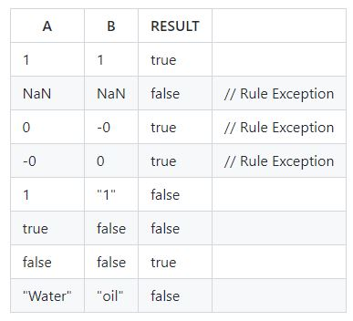

# Week4: First steps with JavaScript

In a module, there is a function named strictEquals(a, b) that gives the value a === b.
For this implementation it has not been used === neither !== operators.

The project has been created using ESLint (airbnb) and prettier. In addition to husky messages.
The main branch has been protected and merged through PR.

Tests have been conducted in a separate file. The set of test are as follows:

